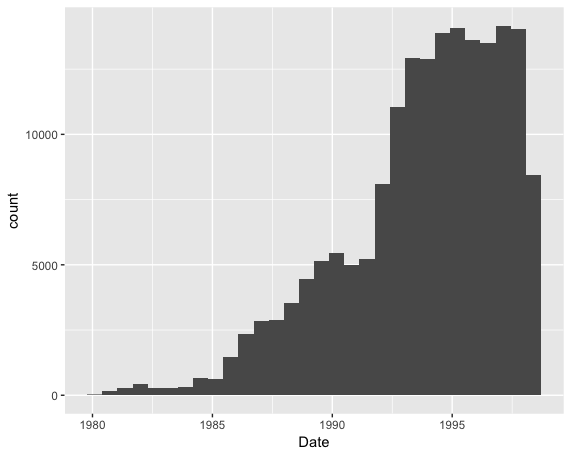

## Setup your environment

```{r}

# Load required libraries

library(tidyverse)

```

## Load your data

```{r}

# data comes from https://www.kaggle.com/uciml/el-nino-dataset

# adding a few settings to correct the data types of a couple of the columns

elnino <- read_csv("data/elnino.csv", na=c(".",NA), col_types = cols(Date = col_date(format="%y%m%d"))) %>% type_convert()

```

## Exploring your data - distributions and change over time

```{r}

# Distributions of Sea Surface Temperature over time

ggplot(elnino) + geom_histogram(aes(`Sea Surface Temp`))

ggplot(elnino) + geom_histogram(aes(`Sea Surface Temp`)) + facet_wrap(~Year)

# don't like the size differences? try density instead
ggplot(elnino) + geom_density(aes(`Sea Surface Temp`)) + facet_wrap(~Year)

# can do the same with bars, using a special code
ggplot(elnino) + geom_histogram(aes(x = `Sea Surface Temp`, y = ..density..)) + facet_wrap(~Year)

# both on the same plot
ggplot(elnino) + geom_histogram(aes(x = `Sea Surface Temp`, y = ..density..)) + geom_density(aes(`Sea Surface Temp`)) + facet_wrap(~Year)

ggplot(elnino) + geom_histogram(aes(x = `Sea Surface Temp`, y = ..density..)) + geom_vline(aes(xintercept=mean(`Sea Surface Temp`, na.rm=T), group=Year)) + facet_wrap(~Year)

ggplot(elnino) + geom_boxplot(aes(x=factor(Year),y=`Sea Surface Temp`))

# Show just mean over time
ggplot(elnino) + geom_line(aes(x=Year, y=`Sea Surface Temp`), stat="summary", fun.y=mean)

# double check calculations
elnino %>% group_by(Year) %>% summarise(avg = mean(`Sea Surface Temp`, na.rm=TRUE))

```

## Try it out

```{r}

# try your own distributions on other columns

```

## Make it yourself



```{r}

# Look at the above chart and try to reproduce it for yourself

```  

```{r}

# Explore on your own


```